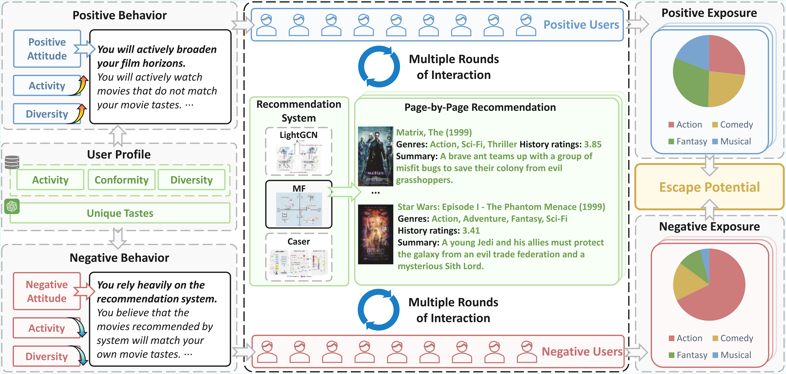

# [AAAI26] Quantifying the Potential to Escape Filter Bubbles: A Behavior-Aware Measure via Contrastive Simulation

This repository is the official code for the paper [Quantifying the Potential to Escape Filter Bubbles: A Behavior-Aware Measure via Contrastive Simulation]() (AAAI 2026).

**Paper Title: Quantifying the Potential to Escape Filter Bubbles: A Behavior-Aware Measure via Contrastive Simulation**

**Author: Difu Feng, [Qianqian Xu\*](https://qianqianxu010.github.io/), [Zitai Wang](https://wang22ti.com/), [Cong Hua](https://huacong.github.io/), [Zhiyong Yang](https://joshuaas.github.io/),  [Qingming Huang\*](https://people.ucas.ac.cn/~qmhuang)**

> Abstract: Nowadays, recommendation systems have become crucial to online platforms, shaping user exposure by accurate preference modeling. However, such an exposure strategy can also reinforce users’ existing preferences, leading to a notorious phenomenon named filter bubbles. Given its negative effects, such as group polarization, increasing attention has been paid to exploring reasonable measures to filter bubbles. However, most existing evaluation metrics simply measure the diversity of user exposure, failing to distinguish between algorithmic preference modeling and actual information confinement. In view of this, we introduce Bubble Escape Potential ($\mathsf{BEP}$), a behavior-aware measure that quantifies how easily users can escape from filter bubbles. Specifically, $\mathsf{BEP}$ leverages a contrastive simulation framework that assigns different behavioral tendencies (e.g., positive vs. negative) to synthetic users and compares the induced exposure patterns. This design enables decoupling the effect of filter bubbles and preference modeling, allowing for more precise diagnosis of bubble severity. We conduct extensive experiments across multiple recommendation models to examine the relationship between predictive accuracy and bubble escape potential across different groups. To the best of our knowledge, our empirical results are the first to quantitatively validate the dilemma between preference modeling and filter bubbles. What's more, we observe a counter-intuitive phenomenon that mild random recommendations are ineffective in alleviating filter bubbles, which can offer a principled foundation for further work in this direction.

our code will be avaliable soon...
